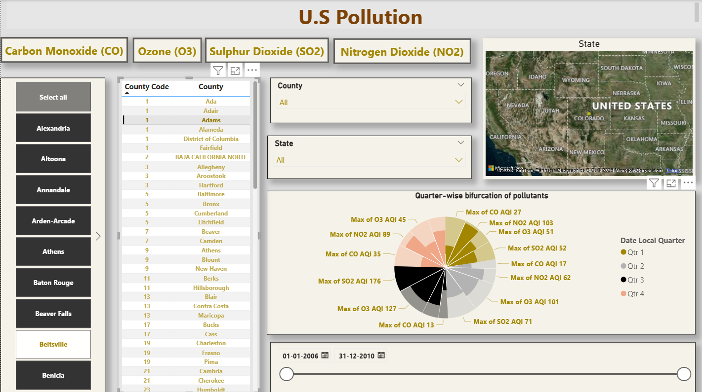
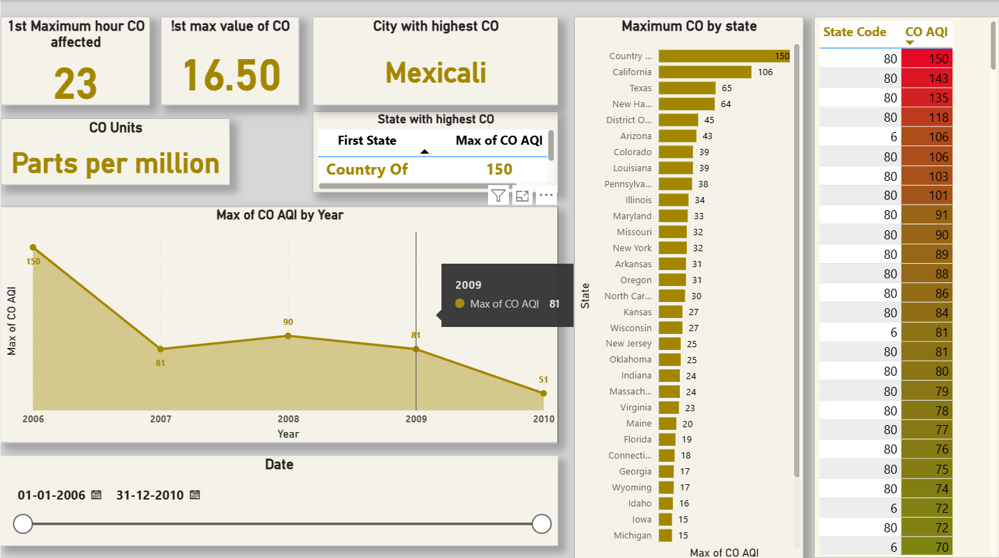
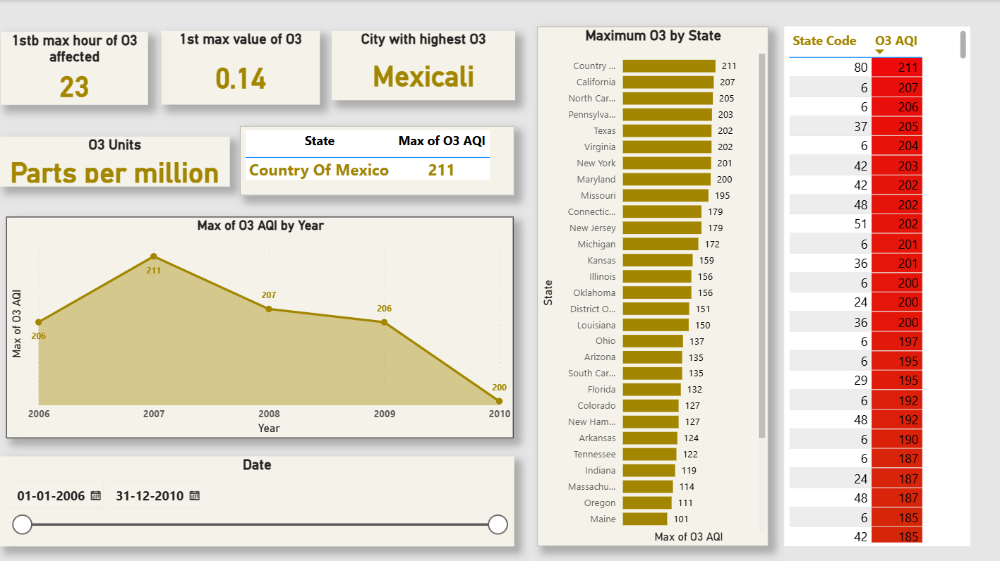
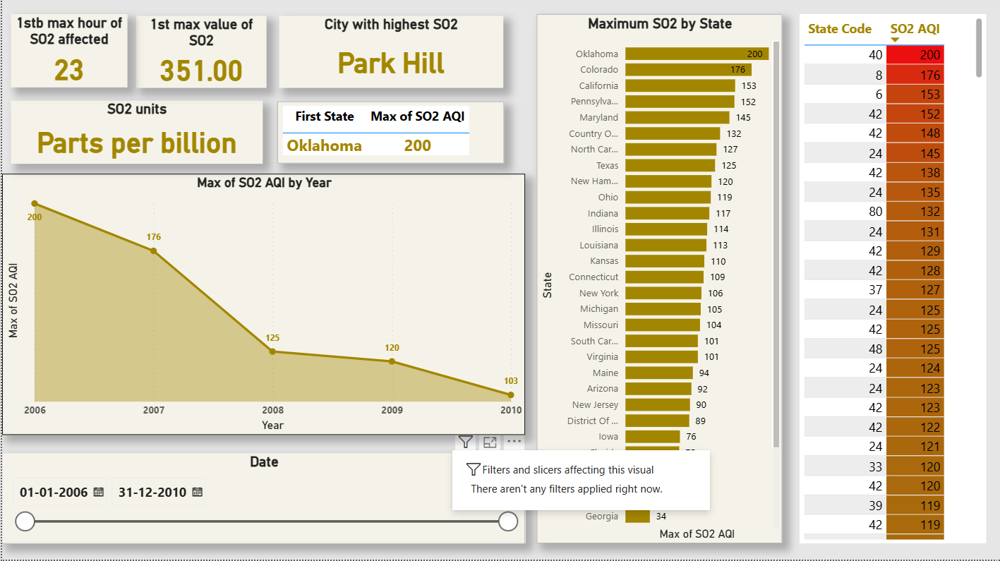
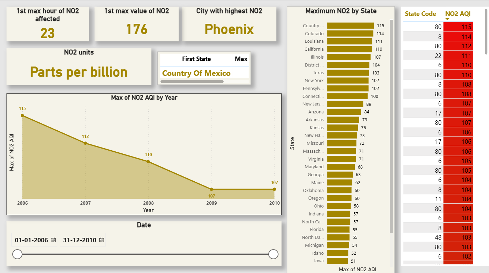

# US-Pollution-Data-Analysis
Power BI Dashboard representing the US Pollution data from year 2006 to 2010. 

## Overview
This repository contains a Power-BI analytics solution designed to provide insights into the US Pollution.
In the dataset, pollutants considered for data visualization are CO, NO2, SO2 and O3.

The Key Performance Indicators (KPIs) used in the analysis are enlisted in the document 'Analyzation(Requirements).docx'. 

## Project Structure

project   
├── README.md # Documentation  
├── datasets/ # raw and cleaned data sources  
├── visuals/ # exported screenshots of dashboards  
├── reports/ # Power BI project files (.pbip)  
└── Analyzation(Requirements).docx

## Technologies Used

* Power BI Desktop - Data Modeling and Visualization
* SQL or Python - Data preprocessing and ETL
* GitHub - Version Control and Collaboration

## Key Features

* Interactive Dashboards with drill-down filters
* Trend Analysis and Forecasting
* KPI tracking across multiple dimensions
* Exportable reports for stakeholders

## Setup Instructions

* Clone the repository
* Open the .pbip file in Power BI Desktop
* Update the data source connections in dataset settings
* Refresh the report to load data

## Dashboard Preview

  
  
  
  

## Contributing

Contributions are Welcome!

* Fork the Repository
* Create a Feature Branch
* Submit a Pull Request

